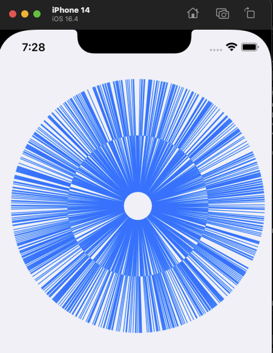
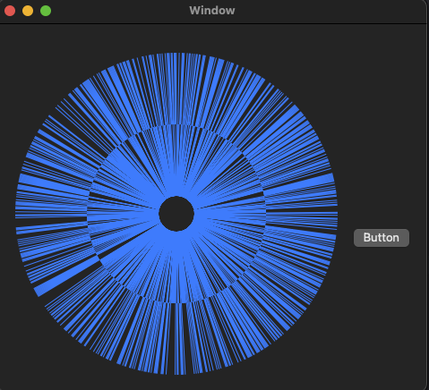

# AxcBedrock


[](https://cocoapods.org/pods/AxcBedrock)


# 介绍
<br>
AxcBedrock是一个基础的工具库，为iOS和macOS应用程序提基础供常用的函数和扩展。

如同MineCraft中的基岩一样，作为世界基础，承担起所有方块。

在将来，还会继续支持Dart等语言（时间够的话😄）[Dart版本点这里（还在开发中..）](https://github.com/axclogo/AxcBedrock-Dart) 

主要思想是想打通开发的连贯性，不局限于一个平台或一个语言，打通开发人员的习惯，让所有底层Api或简单小操作的调用统一

# 安装
您可以使用CocoaPods快速安装AxcBedrock:
Podfile:
```ruby
pod 'AxcBedrock'
```
您也可以手动将源代码添加到项目中。

# 用法
使用AxcBedrock中的函数和扩展非常简单。只需将AxcBedrock导入到您的项目中，即可开始使用。

## 格式/规范
所有API使用都遵循这种格式的命名规范：
```swift
// 实例功能调用：
xxxx.axc.xxxx
// 类功能调用
Xxxx.Axc.Xxxx
```
以此可轻松访问您需要的所有函数和扩展。

## 部分示例
### 调用示例
以下是一个简单的示例，演示如何使用AxcBedrock中的功能：

```swift
import AxcBedrock

let myString = "hello world"
let testString = myString.axc.keepPrefix(count: 3)
print(testString) // "hel"
```

### 富文本操作示例
```swift
let attText = "这是一段富文本".axc.makeAttributed { make in
    make.set(font: 15, range: 0...1)
.set(foregroundColor: "FFBBAA", range: NSRange(location: 0, length: 4))
}
```
| iOS表现 | MacOS表现 |
| ---------------- | ---------------- |
| <br>  | <br>  |

需要注意的是，AxcUnifiedXXX的类为通用类，例如上面示例的设置Font和Color的类分别为：

AxcUnifiedFont和AxcUnifiedColor

这样的类可以兼容并采取以下写法：

**AxcUnifiedFont:**
```swift
make.set(font: 15.axc.uiFont, range: 0...1)
make.set(font: 15.4, range: NSRange(location: 0, length: 4))

make.set(font: UIFont.systemFont(ofSize: 15), range: 0...1)
make.set(font: UIFont.systemFont(ofSize: 15), range: NSRange(location: 0, length: 4))
```

**AxcUnifiedColor:**
```swift
.set(foregroundColor: "FFBBAA", range: 1...2)
.set(foregroundColor: "FFBBAA", range: NSRange(location: 0, length: 4))

.set(foregroundColor: UIColor.red, range: 1...2)
.set(foregroundColor: UIColor.red, range: NSRange(location: 0, length: 4))

.set(foregroundColor: 0xFFBBAA, range: 1...2)
.set(foregroundColor: 0xFFBBAA, range: NSRange(location: 0, length: 4))
```
当然，无论UIColor还是NSColor都可以支持，但是要在对应的平台上使用

### 贝塞尔曲线操作示例
```swift
var linesHeight: [AxcUnifiedNumber] = []
for i in 0...1000 {
    if (arc4random() % 2) == 0 {
        linesHeight.append(80)
    }else{
        linesHeight.append(-80)
    }
}
let bz = UI/NS BezierPath.Axc.CreateRadiateCircle(center: center,
                                                  radius: radius,
                                                  linesHeight: linesHeight,
                                                  clockwise: .clockwise,
                                                  startAngle: .direction(.left),
                                                  openingAngle: 0,
                                                  isReversing: false)
shapeLayer.path = bz.axc.cgPath
```
| iOS表现 | MacOS表现 |
| ---------------- | ---------------- |
| <br>  | <br> 

即便是跨平台，一份代码也够了

##更多有关AxcBedrock中可用函数和扩展的完整列表，请参见代码或导出Swift-Docc文档。

# 问题
如果您在使用AxcBedrock时遇到问题或错误，请在GitHub上提交问题。

如果您在使用过程中，不知道或不明白有哪些Api，也可以在GitHub上提交问题。

# 联系
E-mail邮箱：axclogo@163.com

WeChat：zx532432339 

# 贡献
AxcBedrock是开源的，并感谢任何形式的贡献。如果您发现错误或想改进库，请提交拉取请求。

**目前需协助帮忙~如果有想法的请联系我！或者提PR，谢谢！Orz**

## 需要协助一起的任务还有：
1.完善单元测试部分

2.支持Swift Package Manager

3.如果有需要优化的地方，提出优化项

4.如果有想一起开发Dart版的Bedrock，请联系我！

# 证书
AxcBedrock is available under the MIT license. See the LICENSE file for more info.

# 如果这个库有帮助到你，或者帮助你启发了什么，请给个Star⭐️ ~ ~ Thanks♪(･ω･)ﾉ

