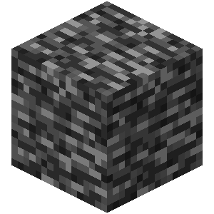
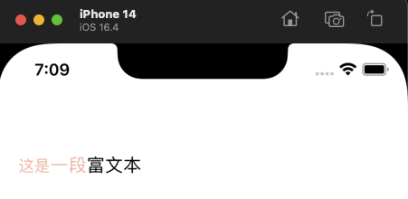
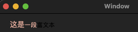
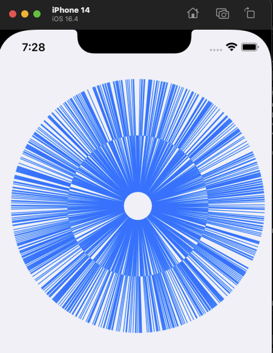
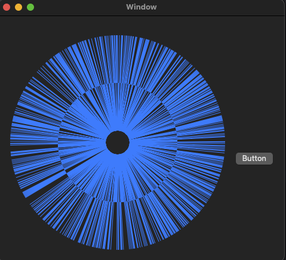

# AxcBedrock


[](https://cocoapods.org/pods/AxcBedrock)


# Language
- en [English](./README.md)
- zh_CN [简体中文](./README.zh_CN.md)

# Introduce
<br>
AxcBedrock is a basic tool library that provides commonly used functions and extensions for iOS and macOS applications.

Like Bedrock in MineCraft, as the foundation of the world, it bears all the blocks.

In the future, it will continue to support languages such as Dart (if time permits 😄) [Click here for the Dart version (still in development..)](https://github.com/axclogo/AxcBedrock-Dart) 

The main idea is to establish coherence in development, not limited to one platform or one language, to connect developers' habits, and to unify the invocation of all underlying APIs or simple small operations.

In terms of functionality, it is similar to [SwifterSwift](https://github.com/SwifterSwift/SwifterSwift), with the main difference being in invocation and use.

For example, SwifterSwift is based on direct extension functions, but because of too many extensions in a large project, when calling APIs and finding APIs, Xcode's completion may cause lagging and it may be difficult to find the needed API.

Therefore, AxcBedrock is based on namespace mode encapsulation, with the suffix ".axc" added where it needs to be invoked, and then the corresponding API can be searched.

I can't say there are many projects, but in the projects I am involved in, this solution really solves the problem of code completion creeping in. It also has good aesthetics and will not cause naming conflicts with the extensions of the main project.


# Install
You can quickly install AxcBedrock using CocoaPods:

Podfile:
```ruby
pod 'AxcBedrock'
```
Alternatively, you can manually add the source code to your project.

# Usage
Using the functions and extensions in AxcBedrock is very simple. Simply import AxcBedrock into your project and you can start using it.

## Format/Specification
All API usage follows this naming convention:
```swift
// Call instance function:
xxxx.axc.xxxx
// Call class function:
Xxxx.Axc.Xxxx
```
In this way, you can easily access all the functions and extensions you need.

## Examples
### Example Call
Here is a simple example to demonstrate how to use the functionality in AxcBedrock:

```swift
import AxcBedrock

let myString = "hello world"
let testString = myString.axc.keepPrefix(count: 3)
print(testString) // "hel"
```

### AttributedText Operations
```swift
let attText = "这是一段富文本".axc.makeAttributed { make in
    make.set(font: 15, range: 0...1)
.set(foregroundColor: "FFBBAA", range: NSRange(location: 0, length: 4))
}
```
| iOS performance | MacOS performance |
| ---------------- | ---------------- |
| <br>  | <br>  |

Note that the classes AxcUnifiedXXX are universal classes. For example, the classes for setting font and color in the example above are:

AxcUnifiedFont and AxcUnifiedColor.

These classes can be used interchangeably and can be written in the following ways:

**AxcUnifiedFont:**
```swift
make.set(font: 15.axc.uiFont, range: 0...1)
make.set(font: 15.4, range: NSRange(location: 0, length: 4))

make.set(font: UIFont.systemFont(ofSize: 15), range: 0...1)
make.set(font: UIFont.systemFont(ofSize: 15), range: NSRange(location: 0, length: 4))
```

**AxcUnifiedColor:**
```swift
.set(foregroundColor: "FFBBAA", range: 1...2)
.set(foregroundColor: "FFBBAA", range: NSRange(location: 0, length: 4))

.set(foregroundColor: UIColor.red, range: 1...2)
.set(foregroundColor: UIColor.red, range: NSRange(location: 0, length: 4))

.set(foregroundColor: 0xFFBBAA, range: 1...2)
.set(foregroundColor: 0xFFBBAA, range: NSRange(location: 0, length: 4))
```
Of course, both UIColor and NSColor are supported, but they must be used on the corresponding platform.

### Bezier Operation
```swift
var linesHeight: [AxcUnifiedNumber] = []
for i in 0...1000 {
    if (arc4random() % 2) == 0 {
        linesHeight.append(80)
    }else{
        linesHeight.append(-80)
    }
}
let bz = UI/NS BezierPath.Axc.CreateRadiateCircle(center: center,
                                                  radius: radius,
                                                  linesHeight: linesHeight,
                                                  clockwise: .clockwise,
                                                  startAngle: .direction(.left),
                                                  openingAngle: 0,
                                                  isReversing: false)
shapeLayer.path = bz.axc.cgPath
```
| iOS performance | MacOS performance |
| ---------------- | ---------------- |
| <br>  | <br> 

Even across platforms, one codebase is enough.

## For a complete list of available functions and extensions in AxcBedrock, please refer to the code or export the Swift-Docc documentation.

# Question
If you encounter any issues or errors while using AxcBedrock, please submit an issue on GitHub.

If you are unsure or unclear about any API while using it, you can also submit an issue on GitHub.


# Connection
E-mail：axclogo@163.com

QQ：532432339 

# Contribution
AxcBedrock is open source and thanks for any contributions. If you find any errors or want to improve the library, please submit a pull request.

**Currently I need help~ If you have any ideas, please contact me! Or submit a PR, thank you! Orz**

Tasks that need help:
- Improve the unit test section
- Support Swift Package Manager
- If there are areas that need optimization, propose optimization items
- If you want to develop a Dart version of Bedrock together, please contact me!

# LICENSE
AxcBedrock is available under the MIT license. See the LICENSE file for more info.

# Please give a Star⭐️ to this repository if it has been helpful to you or has inspired you in any way. ~ ~ Thanks♪(･ω･)ﾉ

