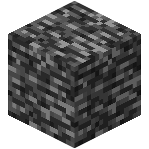
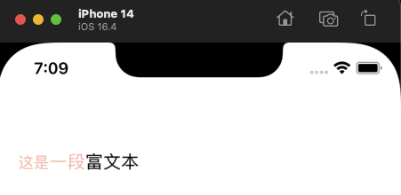
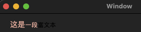

# AxcBedrock


[](https://cocoapods.org/pods/AxcBedrock)


# 介绍
<br>
AxcBedrock是一个Swift工具库，为iOS和macOS应用程序提基础供常用的函数和扩展。

如同MineCraft中的基岩一样，作为世界基础，承担起所有方块.

# 安装
您可以使用CocoaPods快速安装AxcBedrock:
Podfile:
```ruby
pod 'AxcBedrock'
```
您也可以手动将源代码添加到项目中。

# 用法
使用AxcBedrock中的函数和扩展非常简单。只需将AxcBedrock导入到您的项目中，即可开始使用。

## 格式/规范
所有API使用都遵循这种格式的命名规范：
```swift
// 实例功能调用：
xxxx.axc.xxxx
// 类功能调用
Xxxx.Axc.Xxxx
```
以此可轻松访问您需要的所有函数和扩展。

## 示例
### 调用示例
以下是一个简单的示例，演示如何使用AxcBedrock中的功能：

```swift
import AxcBedrock

let myString = "hello world"
let testString = myString.axc.keepPrefix(count: 3)
print(testString) // "hel"
```

### 富文本操作示例
```swift
let attText = "这是一段富文本".axc.makeAttributed { make in
    make.set(font: 15, range: 0...1)
        .set(foregroundColor: "FFBBAA", range: NSRange(location: 0, length: 4))
}
```
| iOS表现 | MacOS表现 |
| ---------------- | ---------------- |
| <br>  | <br>  |


有关AxcBedrock中可用函数和扩展的完整列表，请参见文档。

# 问题
如果您在使用AxcBedrock时遇到问题或错误，请在GitHub上提交问题。

# 作者
axclogo@163.com

# 贡献
AxcBedrock是开源的，并感谢任何形式的贡献。如果您发现错误或想改进库，请提交拉取请求。

# 证书

AxcBedrock is available under the MIT license. See the LICENSE file for more info.
